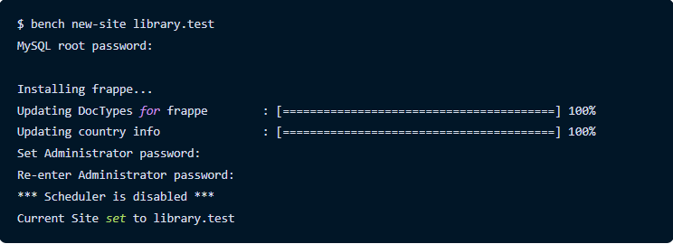

# DailyBlog Pawandeep Singh Thandi

**Date : 1-Feb-2022**
## Introduction to Linux & Installing Ubuntu

Linux is an open-source operating system like other operating systems such as Microsoft Windows, Apple Mac OS, iOS, Google android, etc. An operating system is a software that enables the communication between computer hardware and software. It conveys input to get processed by the processor and brings output to the hardware to display it. This is the basic function of an operating system.

- Download the linux distribution of your choice from the offical sites.
- Creating Boot pendrive using rufus.exe in windows or IOS.
- Restart the system and open boot menu using boot key according to your system .(Eg.- F8, F2 etc.)
- Select your boot device in boot menu.
- Select Install Ubuntu then Click Noraml Installation.
- Select where to install alongside window or Erase disk or something else.
- Then Click next and start ubuntu installation.
- For More detail about Installation Guide [Click here](https://phoenixnap.com/kb/install-ubuntu-20-04)
 

**Date: 2-Feb-2022**
## Introduction to LAMP Stack and Installation

The LAMP stack is a popular open-source solution stack used primarily in web development.LAMP consists of four components necessary to establish a fully functional web development environment. The first letters of the components' names make up the LAMP acronym:
 

- Linux is an operating system used to run the rest of the components.
- Apache HTTP Server is a web server software used to serve static web pages.
- MySQL is a relational database management system used for creating and managing web databases, but also for data warehousing, application logging, e-commerce, etc.
- PHP, Perl, and Python are programming languages are used to create web applications.
- Installing lamp on Ubuntu System.
- Verifying by run LAMP on localhost.

**Date : 3-Feb-2022**
## Run Cgi Script
A CGI script is any program that runs on a web server.

**Date : 4-Feb-2022**
## Image to video
I need to Write a Script used to convert a Images into Video

## Moviepy
MoviePy is a Python module for video editing, which can be used for basic operations (like cuts, concatenations, title insertions), video compositing (a.k.a. non-linear editing), video processing, or to create advanced effects. It can read and write the most common video formats, including GIF

- install usign command pip install moviepy
- install imagemagick run the comand sudo apt install imagemagick
   - goto ---- /etc/ImageMagick-6/policy.xml file  
   - In the file comment out the line
   - "policy domain="path" rights="none" pattern="@*" 
   - you can found this at the bottom part of the file

**Date : 5-Feb-2022**

## Concatenate TextClips and Images
Added the text CLips using the TextClip component from the Movepy Liberary 
and Learned the Methods of Conacatenating Two clips with one another

- Develop a method to add Text just after a image and so on 
- Add CSV files to feth the data in to Script 
- Added some Effect to make the video more 
- Convert the Hard Coded Script into Structured Script

**Date : 8-Feb-2022**
## Introduction to Github Pages
- Getting Information What is GitHub Pages.
- Create a New Repository on GitHub.
- Setting Repository as the main branch and setting a theme for GitHub pages.
"policy domain="path" rights="none" pattern="@*"- Learning about Personal access tokens for push Local Repository on GitHub.
- Learning Syntax of Markdown Language in GitHub.
 

**Date : 10-Feb-2022**
## Introduction To Frappe FrameWork
Frappe FrameWork is a WebFrameWork written in **Python** and **JavaScript** and at the backend it is suppored by **node** js and database is handelled by the **Mariadb**
The key difference in Frappe compared to other frameworks is that meta-data is also treated as data. This enables you to build front-ends very easily. We believe in a monolithic architecture, so Frappe comes with almost everything you need to build a modern web application. It has a full featured Admin UI called the Desk that handles forms, navigation, lists, menus, permissions, file attachment and much more out of the box.

After setting up Frappe Framework, you can be productive in no time. Creating models, wiring controller code and updating views are all handled by the framework.

**Date : 11-Feb-2022** 
## Installation of Frappe FrameWork on linux based System:
For Installation I Followed the installation Guide at [Click TO Reach](https://frappeframework.com/docs/v13/user/en/installation)  
For Frappe FrameWork we need some Pre-requistis i.e.
- **Git**  
- **Python** 
- **Redis** 
- **MariaDB**
- **Node**
- **Bench CLI**
  - Setting Up Bench  
   Run the command to create our bench setup
    - bench init frappe-bench
    - cd frappe-bench 
    - bench start
 
After setting up everything we can Create sites and apps according to our need

 **Date : 12-Feb-2022** 
## Creating a LMS Site on Frappe FrameWork
First we run a command in the terminal 
- bench new-site library.test  
It will ask us to set adiministrator password for the site. 
After setting up password we are good to go.

<!--  -->

When we run the command 
- bench start  
It will start the bench and we can run it on localhost with provides link ad default it will run on  8000 port
 

**Date : 14-Feb-2022** 
## Creating Apps in Frappe
Any kind of applications can be created on frappe wich give more controll and flexible use. 
To create a new app  run command  
- bench new-app library_management

The app will create certains fille in the app folder the whole structure is 
- **library_management**: This directory will contain all the source code for your app
- **public**: Store static files that will be served from Nginx in production
- **templates**: Jinja templates used to render web views
- **www**: Web pages that are served based on their directory path
- **library_management**: Default Module bootstrapped with app
- **modules.txt**: List of modules defined in the app
- **patches.txt**: Patch entries for database migrations
- **hooks.py**: Hooks used to extend or intercept standard functionality provided by the framework
- **requirements.txt**: List of Python packages that will be installed when you install this app

**Date : 15-Feb-2022** 
## Introduction to DocTypes in Frappe:

A DocType is the core building block of any application based on the Frappe Framework. It describes the Model and the View of your data. It contains what fields are stored for your data, and how they behave with respect to each other. It contains information about how your data is named. It also enables rich Object Relational Mapper (ORM) pattern which we will discuss later in this guide. When you create a DocType, a JSON object is created which in turn creates a database table.

To enable rapid application development, Frappe Framework follows some standard conventions.

1. DocType is always singular. If you want to store a list of articles in the database, you should name the doctype Article.
2. Table names are prefixed with tab. So the table name for Article doctype is tabArticle.
3. The standard way to create a DocType is by typing new doctype in the search bar in the Desk.

A DocType not only stores fields, but also other information about how your data behaves in the system. We call this Meta. Since this meta-data is also stored in a database table, it makes it easy to change meta-data on the fly without writing much code.

Before we can create DocTypes, we need to enable developer mode on our bench. This will enable boilerplate creation when we create doctypes and we can track them into version control with our app.

##### bench set-config -g developer_mode true
##### bench start

**Date : 16-Feb-2022** 
### Creating Article DocType for LMS

Go To DocType list and here we can create a new doctype named article :
- Enter the Name for the docType
- Then We select a Module Named LMS which we have created earlier or we can create a new module.
- Now we require fileds for the doctype we created the required below fields in the doctype:
  - Article Name (type = data , and we set it as Mandatory )
  - Image (type = Attach Image )
  - Author ( Data )
  - Description(Text Editor)
  - ISBN(Data) 
  - Status(Select , here we can add a drodown with options Issued and Available )
  - Publisher( Data )
we can also set the naming series for our artcles( as deafult it will use title as series )

After adding the fields, click on Save.Our doctype is created and we can now Add data to our doctype.
Now We can go to the article list and create " Article ".
As we created new article the data wiil be pushed to the database in the form of tables and we can also check its data by giving command in the terminal 

- bench bench --site library.test mariadb

Here it will shoow all the database of a perticluar site.
And we can check and update  our data using differnet sql commands by selecting differnet databasea and tables.

**Date : 17-Feb-2022** 
### Adding functionality to the LMS

A small example in order to provide the full name of the user we defined the following code in the 

**class LibraryMember(Document):** 
     #this method will run every time a document is saved** 
       def before_save(self): 
          self.full_name = f'{self.first_name} {self.last_name or ""}'** 

**Date : 18-Feb-2022** 
###  Creating Different Doctypes with required for the LMS :

### Library MemeberShip
It will have the following fileds 

- Library Member (Link, Mandatory)
- Full Name (Data, Read Only)
- From Date (Date)
- To Date (Date)
- Paid (Check)

We will enable the Submitable Part So after save the one must have to submit it and after submit one cant make any changes to the document.

Now for the functionality:

import frappe 
from frappe.model.document import Document 
from frappe.model.docstatus import DocStatus 

class LibraryMembership(Document): 
    # check before submitting this document 
    def before_submit(self): 
        exists = frappe.db.exists( 
            "Library Membership", 
            { 
                "library_member": self.library_member, 
                "docstatus": DocStatus.submitted(), 
                # check if the membership's end date is later than this membership's start date  
                "to_date": (">", self.from_date), 
            }, 
        ) 
        if exists: 
            frappe.throw("There is an active membership for this member") 

**Date : 19-Feb-2022** 
##  Library Transaction :

- Article - Link to Article
- Library Member - Link to Library Member
- Type - Select with 2 options: Issue and Return
- Date - Date of Transaction

### Adding Validations For the Transaction:

In the library_transaction.py File we going to make some server side code 
For this We added some Code in the library_membership.py file in order to make a track on the valid membership for the library .

 
 

**Date : 21-Feb-2022** 
##  Form Scripts

Form Scripts are client-side javascript code that enhances the UX of your Forms.

example of this code is:
we write this in .js file 
frappe.ui.form.on('Library Member', {
    refresh: function(frm) {
        frm.add_custom_button('Create Membership', () => {
            frappe.new_doc('Library Membership', {
                library_member: frm.doc.name
            })
        })
        frm.add_custom_button('Create Transaction', () => {
            frappe.new_doc('Library Transaction', {
                library_member: frm.doc.name
            })
        })
    }
});

**Date : 22-Feb-2022** 
##  Introduction to Github Pages

- Getting Information What is GitHub Pages.
- Create a New Repository on GitHub.
- Setting Repository as the main branch and setting a theme for GitHub pages.
"policy domain="path" rights="none" pattern="@*"- Learning about Personal access tokens for push Local Repository on GitHub.
- Learning Syntax of Markdown Language in GitHub.

**Date : 23-Feb-2022** 
## Introduction to Reveal.JS, Pandoc, Use of Markdown in Reveal.js

## Reve.js

reveal. js is an open source HTML presentation framework. It's a tool that enables anyone with a web browser to create fully-featured and beautiful presentations for free. Presentations made with reveal. js are built on open web technologies.

- What is Pandoc, Use Markdown in Reveal.js.
- Creating Presentation in Reveal.JS using Markdown only.
- Learn how to show presentation on Local machine.
- Converting .md file into .pdf file using Pandoc.

**Date : 24-Feb-2022** 
##  Introduction to Docker, Virtual Machine and ERPNext

## Docker

Docker is popular virtualization software that helps its users in developing, deploying, monitoring, and running applications in a Docker Container with all their dependencies (frameworks, libraries, etc.) to run an application in an efficient and bug-free manner.Docker Containers are Light-weight, Applications run in isolation,Occupies less space, Easily portable and highly secure, Short boot-up time.

## Virtual Machine

A Virtual Machine (VM) is a compute resource that uses software instead of a physical computer to run programs and deploy apps. One or more virtual “guest” machines run on a physical “host” machine.  Each virtual machine runs its own operating system and functions separately from the other VMs, even when they are all running on the same host. This means that, for example, a virtual MacOS virtual machine can run on a physical PC.

- It can start only a single VM on a VMX.
- It can run only a limited number of VMs on a system.
- It can run multiple containers on a system.
- It can start multiple containers at a time on the Docker engine.
## ErpNext

ERPNext is a full-featured business management solution that helps SMEs to record all their business transactions in a single system. With ERPNext, SMEs can make informed, fact-based, timely decisions to remain ahead in the competition. It serves as the backbone of a business adding strength, transparency, and control to your growing enterprise.

**Date : 25-Feb-2022** 
##  Installing ERPNext Powered by Frappe on our bench: 

- Pre requisite
 - Frappe FrameWork 
- For the perfect installation use this referance [Click here](https://github.com/D-codE-Hub/ERPNext-installation-Guide/blob/main/README.md). 

**Date : 26-Feb-2022** 
##  Introduction to Selenium, Budibase, Coding standard for program
### Selenium 
Selenium is an open source umbrella project for a range of tools and libraries aimed at supporting browser automation. It provides a playback tool for authoring functional tests without the need to learn a test scripting language

### Budibase 
Budibase is a development platform designed for speed and productivity.
With Budibase, developers no-longer experience repetition, long-dev cycles, and frustration. Instead, developers are more productive, happier, and can deliver applications they're proud of in minutes.

### Coding Standards

How to write code in Any script so that it can easily read by other programmer who contribute to your project, take variable name which should be relevant with its function.

- Use appropriate naming conventions.
- Segment blocks of code in the same section into paragraphs.
- Don’t use lengthy functions. Ideally, a single function should carry out a single task.
- Standardize headers for different modules

**Date : 28-Feb-2022**
##  Introduction to Jinja Templating

A Jinja template is simply a text file. Jinja can generate any text-based format (HTML, XML, CSV, LaTeX, etc.). A Jinja template doesn’t need to have a specific extension: .html, .xml, or any other extension is just fine.

A template contains variables and/or expressions, which get replaced with values when a template is rendered; and tags, which control the logic of the template. The template syntax is heavily inspired by Django and Python.

 

**Date : 1-March-2022**
## Education Domain in Erpnext

ERPNext is a free and open-source integrated Enterprise Resource Planning software developed by Frappe Technologies Pvt. Ltd. and is built on MariaDB database system using Frappe, a Python based server-side framework. ERPNext is a generic ERP software used by manufacturers, distributors and services companies.

The ERPNext Education Module helps to organizing your entire set-up. You can have your entire Student Database, Fee Structure, Staffing Information, Courses, Curriculum Which we used for the Project Nanakana Sahib Public School and Guru Nanak Dev Engineering College Ludhiana.

In this Domain We have 
- Basic Setup
- Student
- Admission
- Fees 
- Schedule
- Learning Management System
- Attendance 
- Assessment
- Tools

**Date : 2-March-2022**
##  Setting Up ErpNext for School

First we setup the parent Company with all the details and under that parent company we setup our school which further related to courses, program , room, student category etc.
then our team divided the work for diferent modules.

**Date : 3-March-2022**
##  Fee Module

In the Fee module we have 

- Fee 
- Fee Structure 
- Fee Schedule
- Fee Components 
- Fee Category 

### Fee 

In the Fee section we can create a fee for an Individual student one by one
We have to enter the Student ,due date and we can aslo edit post time and date 
to create a fee we need some of its components which are described below:

- Prerequisites
  - Student 
  - Fee Structure
  - Fee Category

### Fee Structure

In the fee Structure we can define the type of fee like for which class and category of students what kind of fee should be there

In the fee structure we to provide program , student categor, acedamic year, acedamic term .
The important part we have to define the fee category components which includes the different kind of fee. 

### Fee Category

In the Fee Category we simply add the Different Fee components like Tution fee ,Bus fee,Books etc.

Fee Schedule

- Prerequisites
  - Fee Structure
  - Student group

**Fee schedule** is used to add bulk data for fee according to the Student groups and studnet category.
it will divide the grand_total with each group of students.
just go to fee schedule and click new fee schedule
after creating schedule just click create fee button on top that will create fee for the students

### Payment Entry 

To make a payment 
go to fee list  the select a unpaid status candidate 
Now on the top there is a Tab name Create in which we can select make payment and fill the parameters the then submit.

**Date : 4-March-2022**
##  Adding Fine to teh ouver Due fees 
If the due date exceeds then the fine after due date will be automatically added to the grand total for the student. but my logic didnt fit to the right approach and got some errors realted to the fee schedule . so we are keeing it in the future scope.

**Date : 5-March-2022**
## Chat app For the Site 

In the chat app any visitor for the site can ask for any reviews or querries for their doubts and will be answered in the specific time alloted by us by our facility member. 

**Date : 7-March-2022**
## Learning about how to import data in erpnext from csv file

We can generate a csv template regarding ot a particular doctype and trhe we can add a particular data to ethe data type and then we can add the data in the abundace so it can save time.

**Date : 8-March-2022**
##  Learning about how to import data in erpnext from csv file

**Date : 9-March-2022**
##  
**Date : 10-March-2022**
##  
**Date : 11-March-2022**
##  
**Date : 12-March-2022**
##  
**Date : 14-March-2022**
##  
**Date : 15-March-2022**
##  
**Date : 16-March-2022**
##  
**Date : 17-March-2022**
##  
**Date : 18-March-2022**
##  
**Date : 19-March-2022**
##  
**Date : 21-March-2022**
##  
**Date : 22-March-2022**
##  
**Date : 23-March-2022**
##  
**Date : 24-March-2022**
##  
**Date : 25-March-2022**
##  
**Date : 26-March-2022**
##  
**Date : 28-March-2022**
##  
**Date : 29-March-2022**
##  
**Date : 30-March-2022**
##  

